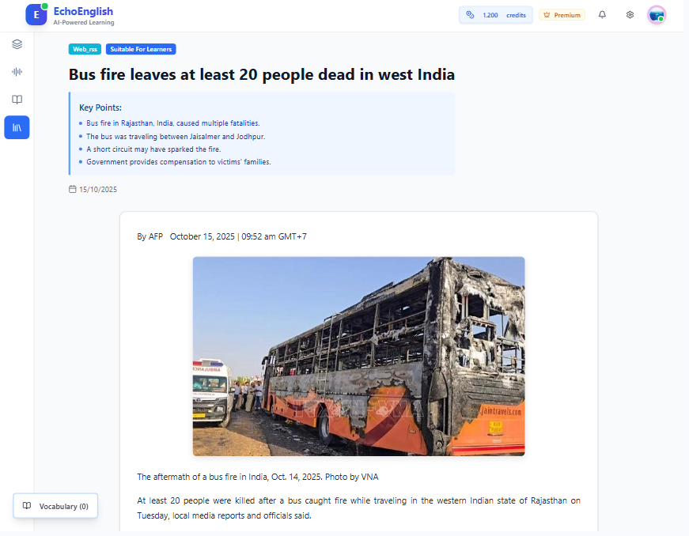

# 🎓 EchoEnglish - AI-Powered English Learning Platform

> A comprehensive backend service for intelligent English language learning with AI-driven features, real-time feedback, and personalized learning paths.

<div align="center">


[Features](#-features) • [Quick Start](#-quick-start) • [Tech Stack](#-tech-stack) • • [Contact](#-contact)

</div>

---

## ✨ Features

- **🤖 AI-Powered Chatbot** - Real-time English learning assistant with intelligent responses
- **🎤 Speech Recognition & Analysis** - Pronunciation assessment and speaking proficiency evaluation
- **✍️ Writing Evaluation** - AI-driven writing assessment with detailed feedback
- **📚 Adaptive Learning Paths** - Personalized study plans based on user proficiency
- **🔤 Flashcard System** - Interactive flashcard management with spaced repetition
- **🎯 Competency Profiling** - Real-time skill tracking and progress monitoring
- **📊 Smart Dashboard** - Comprehensive learning analytics and performance insights
- **💳 Payment Integration** - VNPay & Stripe for premium features
- **📧 Email Notifications** - Real-time alerts and learning reminders
- **🌍 RSS Feed Integration** - Curated English content aggregation
- **🔐 JWT Authentication** - Secure user authentication and authorization
- **⚡ Real-time Communication** - WebSocket support for instant notifications

---

## � Screenshots

**Dashboard**
<p align="center">
  
  
  
</p>
<p align="center">
  
  
</p>

**Learning Route**
<p align="center">
  
  
  
  
  
</p>

**Speech Analyzer**
<p align="center">
  
  
  
  
  
</p>

**Resources & Flashcard**
<p align="center">
  
  
  
  
</p>

**Tests**
<p align="center">
  
  
  
  
</p>

---

## �🚀 Quick Start

### Prerequisites

```
Node.js ≥ 18
MongoDB ≥ 6
npm ≥ 9 or pnpm
```

### Installation

```bash
# Clone the repository
git clone https://github.com/minhkhoavo/EchoEnglish-nodejs.git
cd EchoEnglish-nodejs

# Install dependencies
pnpm install
```

### Environment Setup

Copy the `.env.example` file to `.env` and fill in your configuration values:

```bash
cp .env.example .env
```

### Development

```bash
pnpm dev
```

### Production

```bash
pnpm prod
```

---

## 🛠️ Tech Stack

| Layer | Technology |
|-------|-----------|
| **Runtime** | Node.js |
| **Language** | TypeScript |
| **Framework** | Express.js |
| **Database** | MongoDB + Mongoose |
| **Real-time** | Socket.io |
| **Authentication** | JWT + bcrypt |
| **Storage** | AWS S3 |
| **Payments** | Stripe, VNPay |
| **Code Quality** | ESLint, Prettier, Husky |

---

## 🐳 Docker Support

```bash
# Build Docker image
docker build -t echoenglish-api .

# Run with docker-compose
docker-compose up -d
```

---


## 🤝 Contributors

| Name | ID |
|------|-----|
| Võ Minh Khoa | 22110355 |
| Nguyễn Hoàng Anh Khoa | 22110352 |
| Lê Đình Lộc | 22110369 |
| Võ Văn Trí | 22110444 |

---

---

## 📧 Contact

For inquiries, support, or collaboration:

- **GitHub**: [@minhkhoavo](https://github.com/minhkhoavo)
- **Email**: v.minhkhoa123456@gmail.com
- **Issues**: [GitHub Issues](https://github.com/minhkhoavo/EchoEnglish-nodejs/issues)
- **Discussions**: [GitHub Discussions](https://github.com/minhkhoavo/EchoEnglish-nodejs/discussions)

---

<div align="center">

**[⬆ Back to Top](#-echenglish---ai-powered-english-learning-platform)**

Made with ❤️ by the EchoEnglish Team

</div>
